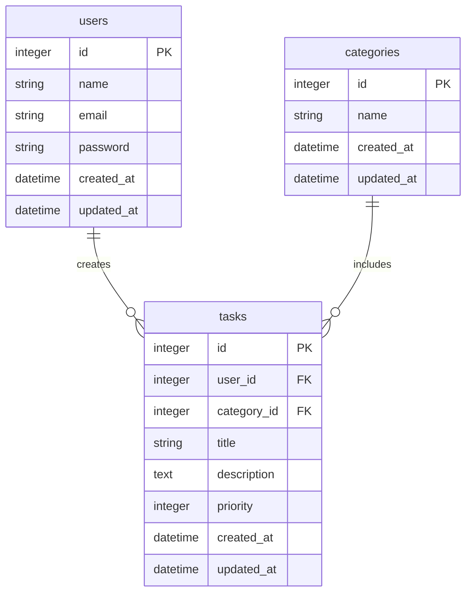

# COACHTECH タスク管理アプリ

個人ユーザーがログインしてタスクの管理、進捗度を把握するアプリ。
システム共通のカテゴリーが用意されており、タスクの優先度は高・中・低と3段階ある。
自分のタスクのみ追加・編集ができる。

## 作成者

小島　春菜

## 使用技術

- Docker version 29.5.3
- Laravel 10.x
- PHP 8.2
- Tailwind CSS


## ER図


## 開発環境URL

http://localhost

## 動作環境

Windows10 WSL2
PHP8.2
Laravel10.X

## 環境構築手順

1. **リポジトリをクローン**

    ````bash
    git clone https://github.com/haruna-kojima/task-manager3.git
    ````

2. **.envファイルの準備**
    ````
    cp .env.example .env
    ````

3. **Composer依存パッケージのインストール**

````
docker run --rm \
    -u "$(id -u):$(id -g)" \
    -v "$(pwd):/var/www/html" \
    -w /var/www/html \
    -e COMPOSER_CACHE_DIR=/tmp/composer_cache \
    laravelsail/php82-composer:latest \
    composer install --ignore-platform-reqs
    ````

4. **Laravel Sailの起動**
    ````
    ./vendor/bin/sail up -d
    ````

5. **アプリケーションキーの生成**

    ````
    ./vendor/bin/sail artisan key:generate
    ````

6. **データベースのマイグレーションと初期データ投入**

    ./vendor/bin/sail artisan migrate --seed

7. **フロントエンドのビルド**

    ````
    ./vendor/bin/sail npm install
    ./vendor/bin/sail npm run dev
    ````

8. **アプリケーションへのアクセス**
    ````
    http://localhost
    ````

## テスト実行

    ○○○○○○ ○○○○○○ ○○○○○○ ○○○○○○ ○○○○○○
    ○○○○○○ ○○○○○○ ○○○○○○ ○○○○○○ ○○○○○○

## 機能一覧

- ユーザー認証 メールアドレスとパスワードでサインアップ
- カテゴリ管理 カテゴリーの作成、編集、削除
- タスク管理 タルクの作成、編集、削除、一覧表示
- 権限制御 自分のタスクしか操作できない

## APIエンドポイント一覧

| HTTPメソッド | URI | 概要 |
|---|---|---|
| GET | /api/tasks | 認証ユーザーのタスク一覧を取得 |
| GET | /api/tasks/{id} | 指定 ID のタスク情報を取得 |
| POST | /api/tasks | 新しいタスクを作成 |
| PUT | /api/tasks | 新しいタスクを作成 |
| DELETE | /api/tasks/{id} | タスクを削除 |
| GET | /api/public/tasks | 公開タスク一覧 |


